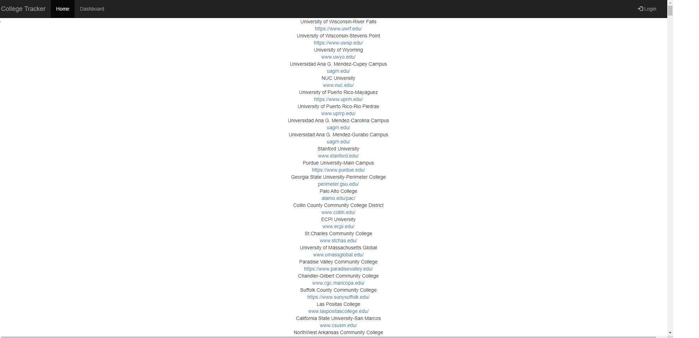

# College Tracker 


[Click Here](https://college-tracker123.herokuapp.com/) to Launch Application

## Table of Contents
- [Description](#description)
- [Image](#image)
- [Code Snippet](#code-snippet)
- [Technologies Used](#technologies-used)
- [Installation](#instalation)
- [Collaborators](#Collaborators)


## Description

The fullstack application uses axios to fetch the api for Government College Card data to populate the homepage with a list of univeristy. For each university a name, school like, tutition both in and out of state, demographics and location are provided. Additionally, a user is able to post a comment to each univeristy in a forum that connects with other users. The user must sign or login to see all of their comments and any saved schools that they may have.


## Code Snippet
```
let url =
	"https://api.data.gov/ed/collegescorecard/v1/schools.json?2020.student.size__range=5000..&_fields=school.name,school.zip,school.city,school.state,school.school_url,2020.student.size,2020.student.demographics.men,2020.student.demographics.women,2020.cost.tuition.in_state,2020.cost.tuition.out_of_state,2020.cost.roomboard.oncampus,2020.cost.roomboard.offcampus,2020.cost.avg_net_price.public,2020.cost.avg_net_price.private,2020.completion.consumer_rate,2020.admissions.admission_rate.overall,2020.academics.program_available.assoc,2020.academics.program_available.bachelors&page=0&api_key=dra3zfoeWMdlOAkY6G0ceNBrdM1sYscwYQbnINMA";

const getColleges = (pageNumber) => {
	// adds current page to the query url
	let query =
		"https://api.data.gov/ed/collegescorecard/v1/schools.json?2020.student.size__range=5000..&_fields=school.name,school.zip,school.city,school.state,school.school_url,2020.student.size,2020.student.demographics.men,2020.student.demographics.women,2020.cost.tuition.in_state,2020.cost.tuition.out_of_state,2020.cost.roomboard.oncampus,2020.cost.roomboard.offcampus,2020.cost.avg_net_price.public,2020.cost.avg_net_price.private,2020.completion.consumer_rate,2020.admissions.admission_rate.overall,2020.academics.program_available.assoc,2020.academics.program_available.bachelors&per_page=100&page=" +
		pageNumber +
		"&api_key="+ process.env.API;
	// returns query results
	return axios.get(query).then((data) => {
		// then if the page has content (is not an empty page), pushes the data to our array
		if (data.data.results.length > 0) {
			collegeResultsData.push(data.data.results);
			// else returns an error
		} else {
			console.log("None");
			return;
		}
	});
};

axios
	.get(url)
	.then((data) => {
		const totalData = data.data.metadata.total;
		// will return the number of pages within the api query
		numPages = Math.ceil(totalData / 100);
	})

	// for each page calls the getColleges helper function
	.then(() => {
		for (var i = 0; i < numPages; i++) {
			pageNumber = i;
			getColleges(i);
		}
	})
```

## Technologies Used
- JavaScript
- Node.js
- MySQL
- Express.js
- Handlebars.js


## Instalation
- inquirer
- mysql2
- dotenv
- sequelize
- express-handlebars
- bcrypt
- express-session
- connect-session-sequelize
- axios 

## Collaborators
- Bradley DiLollo: [GitHub](https://github.com/bdilollo)
- Peter Kim: [GitHub](https://github.com/PeterKim89)
- Morgan Kelly:  [GitHub](https://github.com/mkelly3/)
- Ronald Zhao: [GitHub](https://github.com/ronzhao96)


